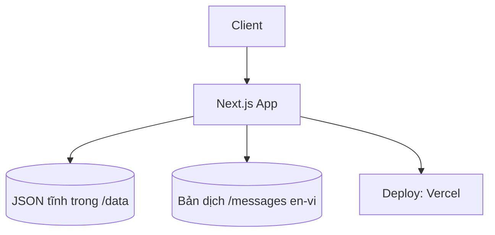

# OPM: The Strongest — Guide Project Specifications

🦸 **Trang thông tin & cẩm nang cộng đồng cho game OPM: The Strongest**

---

## 📌 Problem (Core Idea)

Người chơi OPM: The Strongest hiện phải tự tổng hợp thông tin từ nhiều nguồn rời rạc:

- Thông tin tướng (chỉ số, skill) nằm rải rác trong nhiều bài viết/video
- Các cơ chế/tính năng trong game (Tinh thông - Mastery, và các hệ thống khác) không có nơi giải thích rõ ràng, dễ hiểu
- Người chơi mới không biết bắt đầu từ đâu, thiếu cẩm nang tân thủ tổng hợp
- Thông tin chỉ có tiếng Anh hoặc tiếng Việt riêng lẻ, không đầy đủ cả hai

➡️ **Trang này là nơi tổng hợp thông tin tướng, các tính năng/cơ chế trong game, và cẩm nang hướng dẫn — trình bày rõ ràng, đẹp, dễ đọc, hỗ trợ song ngữ Anh/Việt.**

---

## 🧑‍💻 Users

| Persona | Nhu cầu |
|---|---|
| Người chơi mới | Đọc cẩm nang tân thủ, hiểu cơ bản về game |
| Người chơi lâu năm | Tra cứu thông tin tướng, hiểu sâu cơ chế (Mastery...) |
| Người chơi quốc tế | Đọc nội dung bằng tiếng Anh hoặc Việt tùy nhu cầu |

---

## ✨ Core Features

### A) Character Info (Thông tin Tướng)

- Danh sách tướng: Hero, Villain, Monster Association...
- Trang chi tiết từng tướng: chỉ số, class, rank, skill, hình ảnh, mô tả

### B) Game Features & Mechanics (Tính năng game)

- Trang giải thích riêng cho từng cơ chế trong game: Tinh thông (Mastery), và các hệ thống khác
- Nội dung dạng bài viết, có hình minh họa, dễ hiểu cho người mới

### C) Cẩm nang (Game Guides)

- Hướng dẫn tân thủ (bắt đầu chơi như thế nào, ưu tiên làm gì)
- Các bài hướng dẫn theo chủ đề khác (mở rộng dần theo nhu cầu cộng đồng)

### D) UI/UX cơ bản

- **Dark / Light mode** — cho phép người dùng chuyển đổi, lưu lựa chọn
- **Đa ngôn ngữ Anh/Việt (en/vi)** — chuyển ngôn ngữ toàn trang
- Giao diện đẹp, thân thiện, dễ đọc — ưu tiên trải nghiệm đọc nội dung hơn là nhiều tính năng

> ❌ Chưa cần: search/filter, tier list, so sánh tướng, tài khoản người dùng — có thể thêm sau khi có nhu cầu thực tế rõ ràng.

---

## 🗄️ Data Model (Static JSON — TypeScript type, không cần validate runtime)

> Data là JSON tĩnh, kiểm soát qua code/PR (không phải input từ người dùng cuối) → dùng TypeScript type để bắt lỗi lúc build là đủ, **không cần zod** ở giai đoạn này. Chỉ cân nhắc thêm zod nếu sau này có form công khai cho cộng đồng tự nhập data.

```ts
// lib/types.ts
export interface Character {
  id: string;
  slug: string;
  name: string;
  faction: "hero" | "villain" | "monster";
  rank?: string;        // ví dụ: "S-Class", "Dragon-level"
  class: string;        // ví dụ: "Power", "Speed", "Technique"
  image: string;
  stats: {
    hp: number;
    atk: number;
    def: number;
    spd: number;
  };
  skills: {
    name: string;
    description: string;
  }[];
  description?: string;
}

export interface GuideArticle {
  slug: string;
  title: string;
  category: "mechanic" | "beginner-guide" | "general";
  content: string;      // markdown/MDX content
  updatedAt: string;
}
```

```
/data
  characters.json       // danh sách tướng
  mechanics.json        // dữ liệu tính năng game (Mastery, v.v.)
  guides.json           // cẩm nang, hướng dẫn tân thủ
/messages
  en.json                // bản dịch tiếng Anh
  vi.json                // bản dịch tiếng Việt
```

---

## 🧱 Tech Stack

| Category | Choice |
|---|---|
| Framework | **Next.js 16 (React 19, App Router)** |
| Language | TypeScript |
| Data | Static JSON + TypeScript type (không cần zod) |
| Nội dung dài (guide) | Markdown/MDX |
| Rendering | SSG / ISR (data ít thay đổi) |
| CSS/UI | Tailwind CSS v4 + shadcn/ui |
| Dark/Light mode | `next-themes` |
| Đa ngôn ngữ (en/vi) | `next-intl` |
| State | React state/context (không cần Zustand/Redux) |
| Deployment | Vercel |

---

## 🎨 UI / UX

- **Dark mode & Light mode**: toggle ở header, lưu lựa chọn (theme mặc định theo hệ thống lần đầu truy cập)
- **Ngôn ngữ en/vi**: chuyển đổi ở header, URL dạng `/en/...` và `/vi/...`
- Theme màu lấy cảm hứng từ OPM (vàng/đen/đỏ), nhưng đảm bảo tương phản tốt ở cả 2 mode
- Font rõ ràng, dễ đọc — vì nội dung chính là bài viết/thông tin, ưu tiên trải nghiệm đọc
- Component chính dùng từ shadcn/ui: Card (tướng/tính năng), Tabs (phân loại nội dung), Badge (class/rank), Table (chỉ số)
- Responsive, ưu tiên mobile

### Layout

- Header: Logo + Nav (Tướng / Tính năng / Cẩm nang) + Theme toggle + Language switch
- Trang danh sách: dạng grid card
- Trang chi tiết: nội dung rõ ràng, có mục lục nếu bài dài

---

## 🔌 Kiến trúc (đơn giản)



Không cần API route riêng — toàn bộ nội dung render tĩnh (SSG) lúc build.

---

## 🗂️ Development Workflow

- Nội dung (tướng/tính năng/cẩm nang) chỉnh sửa qua file JSON/MDX, commit qua PR
- Không cần CI/CD phức tạp — Vercel tự deploy khi push
- **Không bao giờ thêm "Co-Authored-By: Claude" (hoặc bất kỳ AI nào) vào commit message**

---

## 🧭 Roadmap

### **MVP**
- Trang danh sách + chi tiết Tướng
- Trang Tính năng game (bắt đầu với Mastery/Tinh thông)
- Cẩm nang tân thủ (1-2 bài đầu tiên)
- Dark/Light mode
- Đa ngôn ngữ en/vi
- Deploy lên Vercel

### **Phase 2**
- Mở rộng thêm cẩm nang theo chủ đề
- Tối ưu SEO (metadata, sitemap, đa ngôn ngữ)
- Cải thiện UI theo phản hồi cộng đồng

### **Future (chỉ khi thực sự cần)**
- Search/filter khi lượng nội dung đủ lớn
- Tier list, so sánh tướng
- Cộng đồng đóng góp nội dung trực tiếp (cần zod validate nếu có form công khai)

> Nguyên tắc chung: chỉ thêm tính năng khi có nhu cầu thực tế rõ ràng, giữ dự án gọn để dễ maintain một mình.

---

## 📌 Status

- Đã khởi tạo project (Next.js 16 + React 19 + Tailwind v4 + TypeScript)
- Đang chuẩn bị setup shadcn/ui, next-themes, next-intl và cấu trúc `/data`, `/messages`

---

🦸 **OPM: The Strongest Guide — Thông tin đầy đủ, cẩm nang rõ ràng, song ngữ Anh/Việt.**