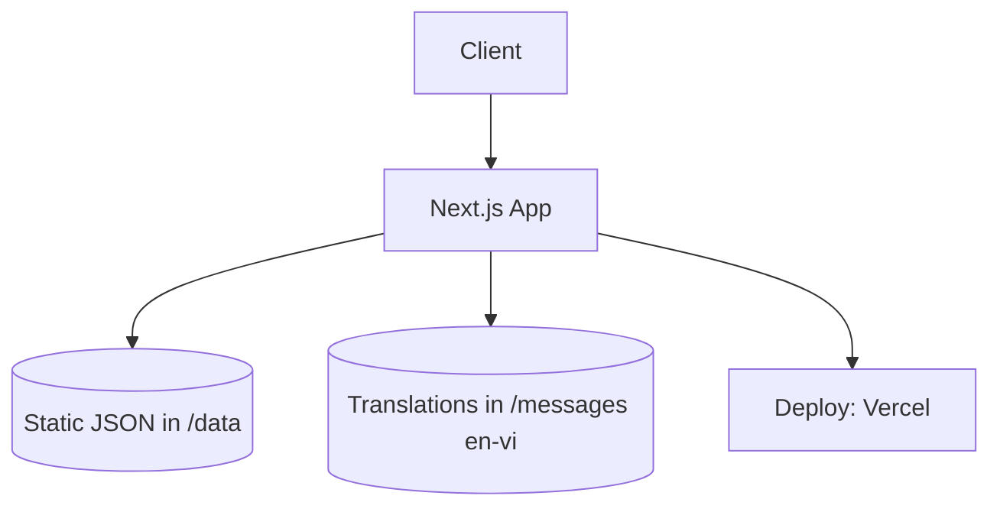

# OPM: The Strongest — Guide Project Specifications

🦸 **Community information & guide hub for OPM: The Strongest**

---

## 📌 Problem (Core Idea)

Players of OPM: The Strongest currently have to piece together information from scattered sources:

- Character info (stats, skills) is spread across many different articles/videos
- In-game features/mechanics (Mastery, and other systems) have no clear, easy-to-understand explanation
- New players don't know where to start, and there's no consolidated beginner guide
- Content exists only in English or only in Vietnamese, never both

➡️ **This site is a single place that consolidates character info, game features/mechanics, and guides — presented clearly, beautifully, and easy to read, with bilingual English/Vietnamese support.**

---

## 🧑‍💻 Users

| Persona | Needs |
|---|---|
| New player | Read beginner guides, understand the game basics |
| Long-time player | Look up character info, understand mechanics in depth (Mastery...) |
| International player | Read content in English or Vietnamese depending on preference |

---

## ✨ Core Features

### A) Character Info

- Character list: Hero, Villain, Monster Association...
- Detail page per character: stats, class, rank, skills, image, description

### B) Game Features & Mechanics

- A dedicated explainer page for each in-game mechanic: Mastery, and other systems
- Article-style content with illustrations, easy for newcomers to follow

### C) Guides

- Beginner guide (how to start playing, what to prioritize)
- Additional topic-based guides (expanded over time based on community needs)

### D) Basic UI/UX

- **Dark / Light mode** — user can toggle, preference is remembered
- **Bilingual English/Vietnamese (en/vi)** — switch language for the whole site
- Beautiful, friendly, readable interface — prioritizing reading experience over feature count

> ❌ Not needed yet: search/filter, tier list, character comparison, user accounts — can be added later once there's a clear real need.

---

## 🗄️ Data Model (Static JSON — TypeScript types, no runtime validation needed)

> Data is static JSON, controlled through code/PR (not end-user input) → TypeScript types catching errors at build time is enough. **No zod needed** at this stage. Only reconsider adding zod if a public form for community data submission is introduced later.

```ts
// lib/types.ts
export interface Character {
  id: string;
  slug: string;
  name: string;
  faction: "hero" | "villain" | "monster";
  rank?: string;        // e.g. "S-Class", "Dragon-level"
  class: string;        // e.g. "Power", "Speed", "Technique"
  image: string;
  stats: {
    hp: number;
    atk: number;
    def: number;
    spd: number;
  };
  skills: {
    name: string;
    description: string;
  }[];
  description?: string;
}

export interface GuideArticle {
  slug: string;
  title: string;
  category: "mechanic" | "beginner-guide" | "general";
  content: string;      // markdown/MDX content
  updatedAt: string;
}
```

```
/data
  characters.json       // character list
  mechanics.json        // game feature data (Mastery, etc.)
  guides.json           // guides, beginner articles
/messages
  en.json                // English translations
  vi.json                // Vietnamese translations
```

---

## 🧱 Tech Stack

| Category | Choice |
|---|---|
| Framework | **Next.js 16 (React 19, App Router)** |
| Language | TypeScript |
| Data | Static JSON + TypeScript types (no zod) |
| Long-form content (guides) | Markdown/MDX |
| Rendering | SSG / ISR (data rarely changes) |
| CSS/UI | Tailwind CSS v4 + shadcn/ui |
| Dark/Light mode | `next-themes` |
| Localization (en/vi) | `next-intl` |
| State | React state/context (no Zustand/Redux needed) |
| Deployment | Vercel |

---

## 🎨 UI / UX

- **Dark mode & Light mode**: toggle in the header, preference saved (defaults to system theme on first visit)
- **Language en/vi**: switcher in the header, URL structure `/en/...` and `/vi/...`
- Color theme inspired by OPM (yellow/black/red), with good contrast maintained in both modes
- Clear, readable fonts — since the main content is articles/information, reading experience comes first
- Main components from shadcn/ui: Card (character/feature), Tabs (content categories), Badge (class/rank), Table (stats)
- Responsive, mobile-first

### Layout

- Header: Logo + Nav (Characters / Features / Guides) + Theme toggle + Language switch
- List pages: grid of cards
- Detail pages: clean content layout, table of contents for longer articles

---

## 🔌 Architecture (simple)



No separate API route needed — all content is statically rendered (SSG) at build time.

---

## 🗂️ Development Workflow

- Content (characters/features/guides) is edited via JSON/MDX files, committed through PRs
- No complex CI/CD needed — Vercel auto-deploys on push
- **Never add "Co-Authored-By: Claude" (or any AI) to commit messages**

---

## 🧭 Roadmap

### **MVP**
- Character list + detail pages
- Game Features page (starting with Mastery)
- Beginner guide (first 1-2 articles)
- Dark/Light mode
- Bilingual en/vi
- Deploy to Vercel

### **Phase 2**
- Expand guides by topic
- SEO optimization (metadata, sitemap, localization)
- UI improvements based on community feedback

### **Future (only when genuinely needed)**
- Search/filter once content volume is large enough
- Tier list, character comparison
- Direct community content contribution (would require zod validation if a public form is added)

> General principle: only add a feature when there's a clear real need — keep the project lean and maintainable by one person.

---

## 📌 Status

- Project initialized (Next.js 16 + React 19 + Tailwind v4 + TypeScript)
- Preparing to set up shadcn/ui, next-themes, next-intl, and the `/data`, `/messages` structure

---

🦸 **OPM: The Strongest Guide — Complete info, clear guides, bilingual English/Vietnamese.**